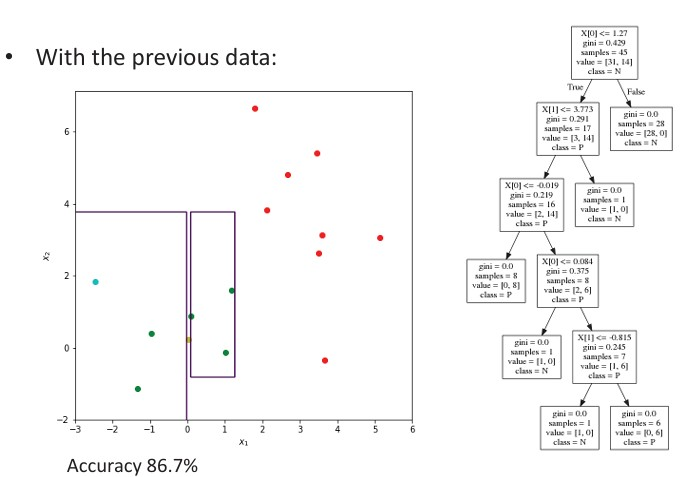
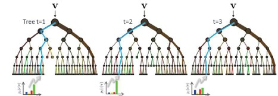
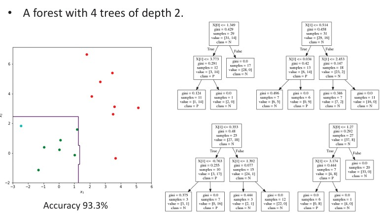

## 27b  Bayesian & Tree Classifiers (part 2) s. 105–106
<!--
### example 106

### Decision tree: example \* 106

### Random forest 107

### Random forest: example \* 107
-->

*pics: 106b 107a 107b*

### Preview

In the previous part, we introduced Bayesian classifiers and decision trees. Now we will go deeper with worked examples of how decision trees are constructed, and then move on to **Random Forests**, which combine multiple trees to create a more powerful classifier.

---

### Automatic construction of a decision tree: example

To see how information content is used to build trees, let’s work through a small example.

Suppose we have two classes:

* **C = {I, II}**
  and features **F = {X, Y, Z}**, each taking values in {0, 1}.

From the training data, we can compute probabilities such as:

$$
P(C = I) = \frac{2}{4} = 0.5, \quad P(X = 1) = \frac{3}{4} = 0.75, \quad P(C=I, X=1) = \frac{2}{4} = 0.5
$$

Using these probabilities, we compute the **information content** for each feature. For example, for **X**:

$$
I(C, X) = P(C=I, X=1) \log_2 \frac{P(C=I, X=1)}{P(C=I)P(X=1)} + \ldots
$$

After calculating, we get:

* $I(C, X) = 0.311$
* $I(C, Y) = 1.0$
* $I(C, Z) = 0.0$

This shows that **feature Y completely discriminates between the two classes**.

📷 Example slide:

---

### Decision tree: example

With real data (like the red and green points we’ve been using), a decision tree splits the feature space step by step.

In the picture:

* The **plot on the left** shows how the tree partitions the data into regions.
* On the **right**, you can see the tree structure. Each node represents a condition like $X[0] \leq 0.419$. Depending on whether the condition is true or false, the sample is sent left or right down the tree.

Accuracy in this example: **86.7%**.

📷 Example slide:

---

### Random forest

A **Random Forest** is simply a collection of decision trees. Instead of relying on a single tree (which might overfit), multiple trees are trained with some randomness:

* Each tree gets a random selection of features and thresholds.
* At the leaf nodes, probabilities $p_t(c|v)$ are computed from training data.
* The final decision is made by averaging across all trees:

$$
p(c|v) = \frac{1}{T} \sum_{t=1}^T p_t(c|v)
$$

**Properties of random forests**:

* Can handle multiple classes.
* Output is probabilistic (not just “yes/no”).
* Generalize well to unseen data.
* Computationally efficient in practice.

📷 Random forest diagram:

---

### Random forest: example

Here we see a **forest with 4 trees of depth 2**.

* On the **left**, the green and red points are classified with decision boundaries that are less “sharp” compared to a single tree.
* On the **right**, you see the four small trees that form the forest.

The accuracy here is **93.3%**, showing how combining trees boosts performance.

📷 Example slide:

---

### Recap

* We practiced calculating **information content** to automatically build decision trees.
* A single decision tree can achieve reasonable accuracy, but it may overfit.
* **Random forests** improve on this by combining multiple trees, reducing overfitting and increasing robustness.

---

### 💡 Stop to think

Why do you think combining multiple “weak” classifiers (trees) into a forest improves performance compared to relying on just one?

---

Would you like me to also prepare **short inline examples** (like with toy probabilities for Y and Z) that students can quickly calculate by hand? That could make this section more interactive.

