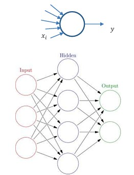
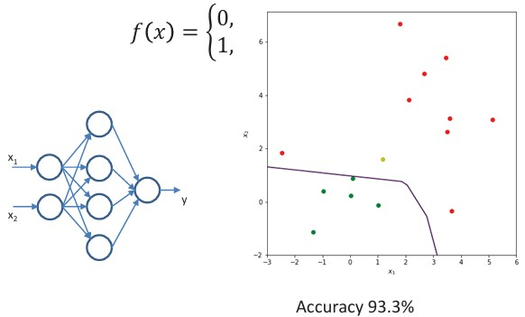
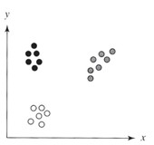
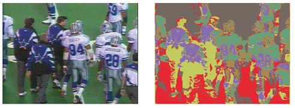
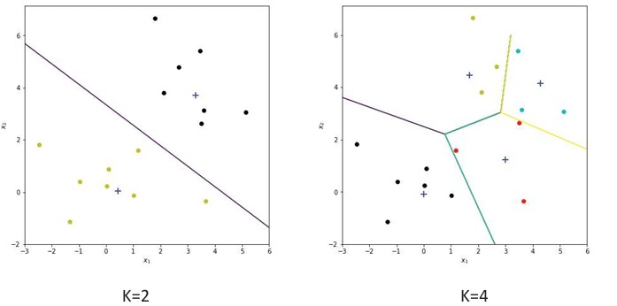
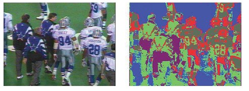

## 28  Neural Networks & Clustering s. 107–110
<!--
### Artificial neural networks 108

### Multilayer perceptron: example \* 108

### Unsupervised learning via clustering 109

### Classical clustering algorithms 109

### Iterative K-means clustering 110

### K-means: example \* 110

### Isodata clustering 111
###  Isodataclustering (cont.) 111
-->

### Preview

In this section, we introduce two powerful ideas in machine learning: **artificial neural networks (ANNs)** and **clustering methods**. ANNs are inspired by how the human brain processes information and are used for supervised learning tasks such as classification. Clustering, on the other hand, is an **unsupervised learning method**, where the goal is to group data points into clusters without knowing the correct labels. Together, they give us tools to model both **complex nonlinear functions** and **hidden structures in data**.

---

### **Artificial neural networks**

Artificial neural networks (ANNs) are a family of learning algorithms inspired by biological neural networks in the brain.

* They consist of a **network of interconnected neurons**.
* A single neuron computes an output:

$$
y = f\Big(\sum_i w_i x_i + b_i\Big)
$$

where:

* $w_i$ = weights (strength of input connections),

* $b_i$ = bias (intercept),

* $f(x)$ = activation function (examples: Sigmoid, Tanh, ReLU).

* A common type of ANN is the **multilayer perceptron (MLP)**:

  * Organized into **input, hidden, and output layers**.
  * Fully connected: every neuron in one layer connects to all neurons in the next.

* Learning happens by adjusting weights using **backpropagation**, where errors are propagated backward through the network.

* ANNs can approximate very complex, nonlinear relationships.

*Illustration of a neuron and a simple feed-forward ANN structure.*

---

### **Multilayer perceptron: example**

* Here we use a neural network with:

  * 2 input nodes,
  * 1 hidden layer with 4 nodes,
  * 1 output node.
* The **ReLU activation function** is used:

$$
f(x) = \max(0, x)
$$

* The decision boundary adapts to nonlinear patterns in the data.
* Accuracy reaches **93.3%**, higher than many of the previous simpler classifiers.

*Example: MLP with nonlinear decision boundary improving accuracy.*

---

### **Unsupervised learning via clustering**

**Clustering** is the process of grouping data points (feature vectors) into subsets called **clusters**.

* Each cluster contains points that are more similar to each other than to points in other clusters.
* Example: In a 2D Euclidean space, a set of points can be separated into three differently colored clusters.
* Clustering is a form of **vector quantization**, useful in data compression, image analysis, and pattern discovery.

*Example of 3 clusters in Euclidean space.*

---

### **Classical clustering algorithms**

In image analysis, feature vectors can include:

* Intensity values,
* RGB color properties,
* Local descriptors,
* Texture measurements.

Pixels can be grouped into clusters to form meaningful image regions.

A common approach is to minimize the **least squares error measure**:

$$
D = \sum_{k=1}^{K} \sum_{x_i \in C_k} \|x_i - m_k\|^2
$$

where $C_k$ are the clusters and $m_k$ are their mean vectors.

⚠️ Exact minimization is infeasible, so algorithms approximate the solution.
An important issue is whether the number of clusters $K$ is known in advance.

* Some methods require $K$ as input.
* Others try to estimate the best $K$.

---

### **Iterative K-means clustering**

The **K-means algorithm** is one of the simplest and most popular clustering methods.

Steps:

1. Initialize iteration counter $ic = 1$.
2. Randomly select $K$ initial means $m_1, m_2, …, m_K$.
3. Assign each vector $x_i$ to the nearest cluster center.
4. Update cluster means.
5. Repeat until convergence.

Example with $K=6$: clustering in RGB space of an image.

---

### **K-means: example**

The effect of different $K$:

* With $K=2$, the data is divided into two broad groups.
* With $K=4$, the division is finer, with more detailed boundaries.

---

### **Isodata clustering**

**Isodata clustering** extends K-means with a **split-and-merge strategy**:

* Clusters can be split if they are too spread out, or merged if they are too close.
* This allows the algorithm to automatically adapt the number of clusters.

Formally, for cluster means $m_k$ and covariance matrix $\Sigma_k$:

$$
\Sigma_k = \begin{bmatrix}
\sigma_{11} & \sigma_{12} & \cdots & \sigma_{1n} \\
\sigma_{21} & \sigma_{22} & \cdots & \sigma_{2n} \\
\vdots & \vdots & \ddots & \vdots \\
\sigma_{n1} & \sigma_{n2} & \cdots & \sigma_{nn}
\end{bmatrix}
$$

where:

* $\sigma_{ii} = \sigma_i^2$ is the variance of component $i$,
* $\sigma_{ij} = \rho_{ij} \sigma_i \sigma_j$ is the covariance between components $i$ and $j$.

---

### **Isodata clustering (cont.)**

Algorithm outline:

1. Assign $x_i$ to cluster $l$ that minimizes

$$
D_{\Sigma} = (x_i - m_l)^T \Sigma_l^{-1} (x_i - m_l)
$$

2. Merge clusters if their means are close.
3. Split clusters if their spread is too large.
4. Stop when convergence or maximum iterations are reached.

Example: clustering in RGB space with variance threshold $\tau_v = 10\%$ of cube side.

---

### **Recap**

* ANNs are powerful supervised learners, capable of nonlinear classification.
* MLPs with hidden layers can learn complex decision boundaries.
* Clustering is an **unsupervised** technique for grouping data points.
* K-means is simple but requires choosing $K$.
* Isodata clustering improves flexibility by splitting/merging clusters.

---

### **Stop to Think**

How might combining **unsupervised clustering** with **neural networks** help in real-world applications, such as image segmentation or anomaly detection?

---
