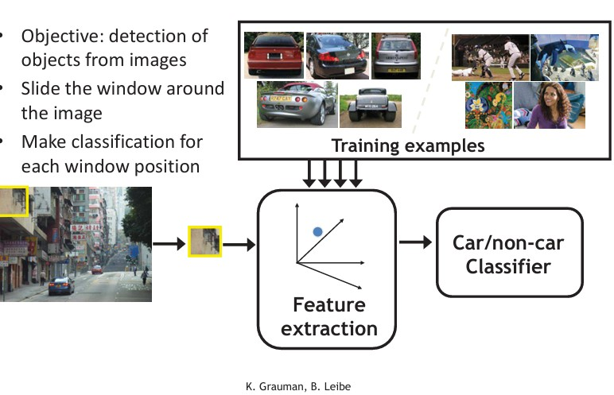
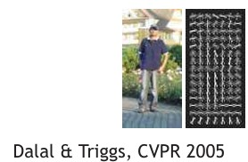
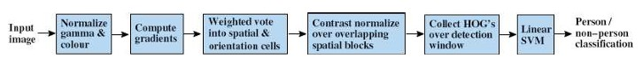
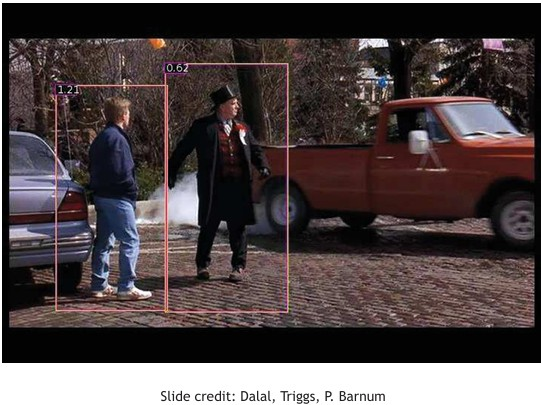
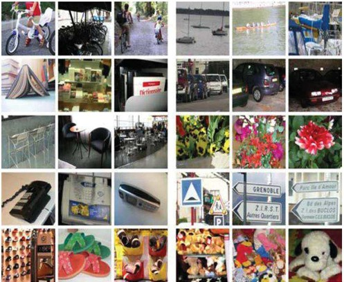
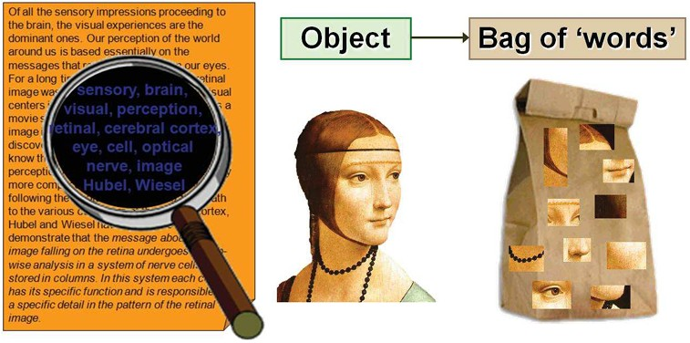
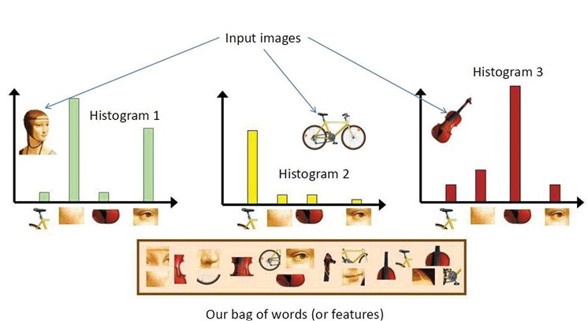
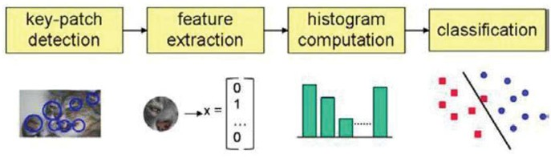

## 29a Applications: Detection & Category Recognition (part 1)
<!--
### Application problem: detection via classification (112)

### Example: pedestrian detection (112)

### Example: pedestrian detection (113)

### Application problem: recognition of categories (113)

### Bag of words (114)

### Word histograms (114)

### Category recognition system (115)

### Codewords dictionary formation (115)
-->

### Preview

In this section, we focus on **practical applications** of computer vision methods: detecting objects in images, identifying specific categories like pedestrians, and recognizing broader categories of objects (e.g., cars, flowers, or instruments). We also introduce the **Bag of Words (BoW) approach**, which represents images as distributions of “visual words.” These methods form the foundation of modern image recognition pipelines.

---

### Application problem: detection via classification

The goal of object detection is to find **where** in an image a certain object is located. One common approach is to use **sliding windows**:

* A window is moved step by step across the entire image.
* For each window position, we extract features and classify whether the window contains the target object (e.g., a car) or not.

The system is trained using positive examples (images of cars) and negative examples (images without cars). Then, for a new image, the system classifies each region.

The figure shows how training examples are processed through **feature extraction** before being fed to a classifier that outputs “car” or “non-car.”

---

### Example: pedestrian detection (part 1)

One of the most famous approaches for detecting people is based on **Histograms of Oriented Gradients (HoG)**.

Steps:

1. Start with an input image.
2. Compute a **gradient image**, which highlights edges and contours.
3. Divide the image into small cells. For each cell, compute a histogram of gradient orientations (directions of edges).
4. Normalize histograms over larger overlapping blocks to make them robust to lighting changes.

This produces a feature descriptor for the whole window.

In practice, each grid cell’s histogram captures how edges are distributed, which is a strong indicator of the presence of a person.

---

### Example: pedestrian detection (part 2)

The detection pipeline combines all these steps into a classifier.

Process:

1. Normalize gamma and color of the image.
2. Compute gradients.
3. Aggregate them into orientation cells.
4. Normalize histograms across overlapping blocks.
5. Collect all HoG features for the detection window.
6. Classify using a **linear SVM** into “person” vs. “not a person.”

In the example, bounding boxes are drawn around detected pedestrians, each with a confidence score (e.g., 1.21 or 0.62).

---

### Application problem: recognition of categories

Beyond detecting a single object, we often want to **recognize object categories**.

The challenge: Given an image X, how do we decide which category Y it belongs to (e.g., “car,” “flower,” “chair”)?

The picture shows a variety of categories: vehicles, animals, instruments, and daily objects.

---

### Bag of words

The **Bag of Words (BoW)** model, originally from text processing, can also be applied to images.

* In text, a document is represented by the frequencies of words it contains.
* In images, we treat local image patches or features as “visual words.”
* Each image is then represented by a histogram of these visual words.

This means an image can be described not by raw pixels, but by **which features (visual words) occur** and how often.

---

### Word histograms

To build the bag of words representation:

1. Extract features from each image.
2. Assign features to “visual words” (like clustering descriptors).
3. Build histograms showing how many times each word appears.

For example:

* A portrait image has strong counts of eye and face features.
* A bicycle image has wheel and bar features.
* A violin image has curved and string-like features.

These histograms are then compared for classification.

---

### Category recognition system

The pipeline for category recognition typically involves:

1. **Key-patch detection** (e.g., Harris or DoG detectors to find interesting points).
2. **Feature extraction** (e.g., SIFT descriptors).
3. **Histogram computation** (count the distribution of codewords in the image).
4. **Classification** (e.g., using an SVM).

This transforms raw images into a structured representation that machine learning models can use.

---

### Codewords dictionary formation

How do we define the “visual words”?

* We first extract descriptors (e.g., SIFT) from training images.
* We then cluster them using a method such as **K-means**.
* Each cluster center becomes a **codeword**.
* Each new patch is assigned to its nearest codeword.

The figure shows how descriptors are grouped into codewords, creating a **dictionary of visual words.**

---

### Example: a sheep or not a sheep

A practical example: classifying whether an image contains a sheep.

* Extract SIFT features from training images of sheep and non-sheep.
* Assign them to codewords in the dictionary.
* Compute histograms of word frequencies.
* Train a classifier (e.g., SVM) to separate “sheep” from “non-sheep.”

By comparing histograms of visual words, the system learns to detect whether the essential features of a sheep are present.

---

### Recap

* Object detection often uses sliding windows and classifiers.
* Pedestrian detection became highly effective using **HoG + SVM.**
* Recognition of categories is a broader problem, handled using **Bag of Words representations**.
* BoW relies on **feature extraction, codeword dictionaries, and histograms.**

---

### Reflective question

If we rely on a fixed **dictionary of visual words**, what challenges might arise when new, unseen categories or very different visual appearances are introduced?

---

