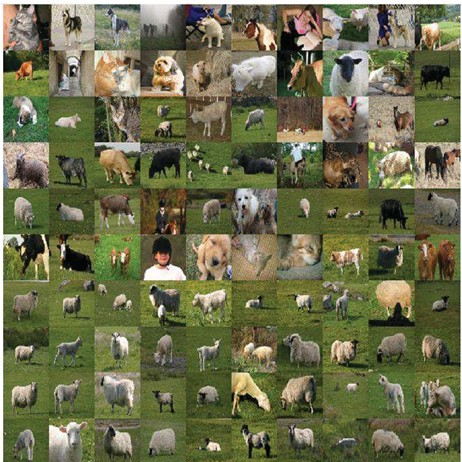
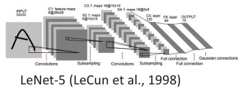
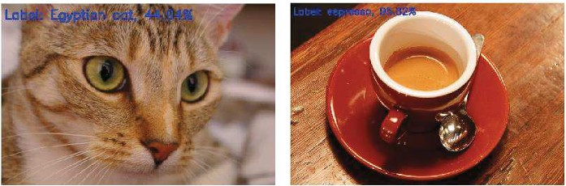
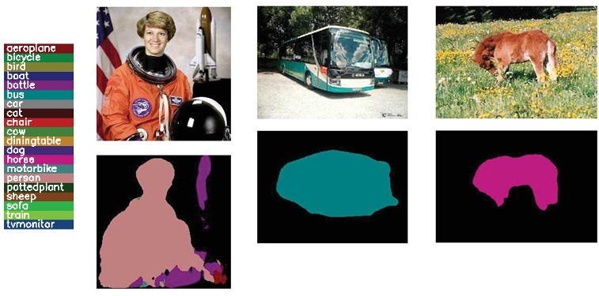

## **29b Applications: Deep Learning & Modern Recognition (part 2)**

(pics: 116a, 116b1, 116b2, sheep-example, 117a, 117b, 118a)

### Preview

In the previous part, we studied object detection and category recognition using methods such as sliding windows, histograms of gradients, and bag-of-words. In this part, we move into **modern deep learning approaches**, which now dominate computer vision tasks. We will see how **deep neural networks** learn features directly from data, replacing manual feature engineering. Finally, we’ll look at examples of **image recognition, object detection, and semantic segmentation**, which are now state-of-the-art solutions in AI.

---

### Example: a sheep or not a sheep

Before moving into deep learning, consider a classic recognition problem: *is the picture showing a sheep, or not a sheep?*

* Traditionally, recognition pipelines extract **hand-crafted features** such as SIFT or HOG descriptors, then classify them using SVM or other classifiers.
* However, these methods can struggle with **variability in background, lighting, and viewpoint**, as shown in the images above. Sheep appear in different poses, with grass, with other animals, or even partly occluded.

This motivates the shift to **deep learning**, where networks learn robust, high-level features directly from large datasets.

---

### Deep neural networks

* **Convolutional Neural Networks (CNNs)** combine feature extraction and classification in a single framework.
* **Features are learned from data**, instead of being manually designed.
* CNNs use **shared weights**: a neuron only processes a small subregion of the image (its **receptive field**), but this pattern is repeated across the whole image.

With **many layers stacked together**, we get **deep neural networks (DNNs)**, which:

* Require **large datasets** and **GPU training**.
* Achieve **superior performance** compared to handcrafted features.

Historical milestones:

* **LeNet-5 (1998)** – early CNN for digit recognition.
* **AlexNet (2012)** – breakthrough deep CNN, won ImageNet challenge.
* **ResNet (2015)** – introduced *residual connections*, enabling training of very deep networks (152+ layers).

---

### Image recognition: example

* **GoogleNet (2015)**: a CNN with 22 layers.
* Winner of **ILSVRC 2014**, achieving a **top-5 error rate of only 6.7%** – a huge improvement over older methods.

Examples:

* Left: correctly classifies the image as an *Egyptian cat*.
* Right: recognizes a cup of *espresso*.

This demonstrates how CNNs can recognize objects **directly from raw pixel data**, with impressive accuracy.

---

### Object detection: example

Detection requires not only recognizing objects, but also **localizing them** with bounding boxes.

* One of the most influential methods is **YOLO (You Only Look Once)**.
* Unlike sliding-window methods, YOLO predicts bounding boxes and class labels **in a single pass**, making it **very fast**.
* Implementations (e.g., in Python + OpenCV) can detect **80 object categories** in real time.

Example above: YOLO detects **bicycle, dog, and truck** in one image.

---

### Semantic segmentation: example

Segmentation goes beyond detection: instead of just bounding boxes, it assigns a **class label to each pixel** in the image.

* **Fully Convolutional Networks (FCN)**, introduced by Long et al. (2015), were a major breakthrough.
* Each pixel in the input image is classified, producing a **dense segmentation map**.

Example:

* The astronaut, bus, and cow images are segmented pixel by pixel, with each class assigned a different color.
* This enables applications in **autonomous driving, medical imaging, and robotics**.

---

### Recap

* Traditional methods struggled with variability in recognition tasks.
* Deep learning, particularly CNNs, revolutionized image analysis by **learning features automatically**.
* We saw key applications:

  * **Image recognition** (GoogleNet, AlexNet, ResNet)
  * **Object detection** (YOLO)
  * **Semantic segmentation** (FCN)
* These tasks are now essential in computer vision, powering technologies from self-driving cars to face recognition.

---

### Reflective question

How does semantic segmentation go beyond object detection, and why might it be more useful in applications like **autonomous driving** or **medical image analysis**?

---

<!-- ALKUPERAÄINEN ##  Applications: detection, pedestrian detection, bag of words, deep networks (p.111–117) PART 1
<!--
### Application problem: detection via classification 112

### Example: pedestrian detection 112

### Example: pedestrian detection 113

### Application problem: recognition of categories 113

### Bag of words 114

### Word histograms 114

### Category recognition system 115

### Codewords dictionary formation 115

### Example: a sheep or not a sheep 116

### Deep neural networks 116

### Image recognition: example* 117
### Object detection: example 117

### Semantic segmentation: example \* 118

