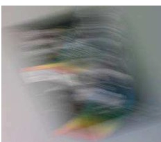
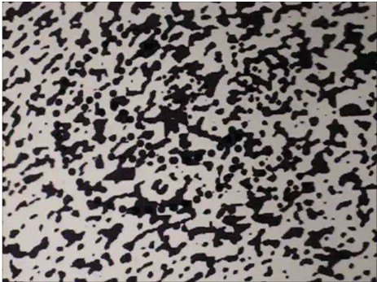
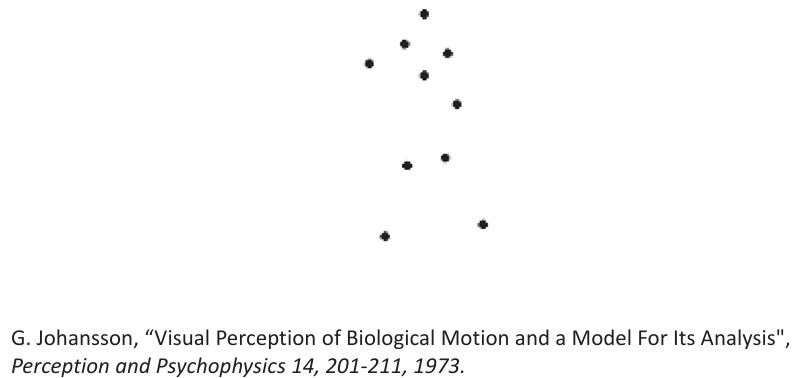
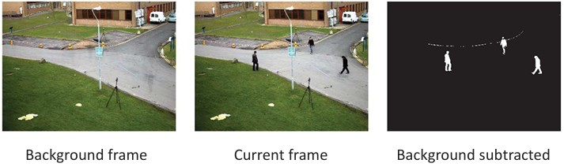

## 29  Why Motion & Background Subtraction s. 118–121
<!--
### Why motion? 119

### Motion and perceptual organization 119

### Motion and perceptual organization 120

### Use of motion 120

### Background subtraction \* 121

### Background modeling 121

### Foreground detection 122

### Simple recursive background modeling 122

### 
-->

### Why motion?

Visual motion plays a crucial role in computer vision, but it has two sides:

* **Motion can be annoying**

  * Cameras often suffer from instabilities such as jitter or blur.
  * To stabilize the video, motion needs to be **measured** and then **removed**.

* **Motion indicates dynamics in a scene**

  * Objects move, and motion tells us about their **behavior**.
  * By analyzing motion, we can **track objects** and study their **trajectories**.

* **Motion reveals spatial layout**

  * This happens through **motion parallax**: nearby objects move faster across the field of view than distant ones, helping us infer depth.

(Top: blurry motion due to camera shake. Bottom: motion parallax with flowers and houses at different depths.)

---

### Motion and perceptual organization

Sometimes motion is the **only cue** to recognize patterns.

For example, in a random static black-and-white dot field, we may not see anything special. But if parts of the dots **move together**, our brain immediately perceives a shape or structure.

(Without motion, it’s just noise. With motion, a clear object appears.)

---

### Motion and perceptual organization (biological motion)

Even very **impoverished motion data** can create strong perception.

In a classic study by Johansson (1973), only a few moving **dots** were placed on the main joints of a walking human. When stationary, they look like random points. But once in motion, we instantly recognize a **person walking**.

This shows how motion is fundamental for **perceptual organization**.

---

### Use of motion

Motion analysis has many applications:

* **Estimating 3D structure** from a sequence of images.
* **Segmenting objects** using motion cues.
* **Tracking and learning dynamical models** of behavior.
* **Recognizing events and activities** in video.

Typical motion-related tasks include:

* Background subtraction
* Motion estimation
* Motion tracking
* Motion feature extraction

---

### Background subtraction

One of the simplest but most powerful uses of motion is **background subtraction**.

* The idea: eliminate the static background and extract only **moving objects**.
* It works through **pixel-by-pixel comparison** between the current frame and a background reference.
* Example: we compute the absolute difference between the two frames and apply a threshold.

$$
F(x,y) = 
\begin{cases} 
1 & \text{if } |I(x,y) - B(x,y)| > T \\
0 & \text{otherwise}
\end{cases}
$$

Here, \$I(x,y)\$ is the current frame, \$B(x,y)\$ is the background frame, and \$T\$ is a threshold.

(Left: background frame. Middle: current frame. Right: background subtracted, showing only people moving.)

---

### Recap

* Motion is important for both **stabilization** (removing unwanted jitter) and **understanding dynamics** (tracking and depth perception).
* Human vision relies heavily on motion to **organize perception**.
* In computer vision, motion analysis helps in **3D reconstruction, tracking, segmentation, and activity recognition**.
* **Background subtraction** is the first step for detecting moving objects in video.

---

### Reflective Question

Why do you think motion can sometimes be a **better cue than appearance** for recognizing objects? Can you think of real-world examples where this is the case (e.g., night surveillance, sports tracking)?

---

