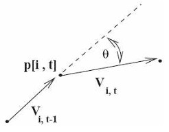
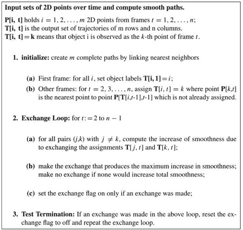
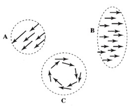
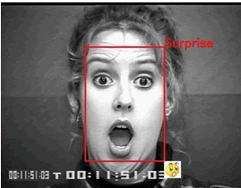
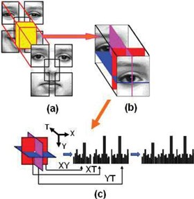

## 33 Tracking & Motion Features  

### Preview  
In this section, we explore how objects are tracked over time, how smooth motion paths can be computed, and how motion itself can be treated as a feature. We’ll also see how texture and motion together can be used to recognize activities, such as facial expressions.  

---

### Computing the paths of moving points  
  

- A **trajectory point** $p_{i,t}$ has smoothness defined as:  

$$

S_{i,t} = w \left( \frac{V_{i,t-1} \cdot V_{i,t}}{|V_{i,t-1}||V_{i,t}|} \right) + (1-w) \left( \frac{2\sqrt{|V_{i,t-1}||V_{i,t}|}}{|V_{i,t-1}|+|V_{i,t}|} \right)
$$  

- Here $V_{i,t} = p_{i,t+1} - p_{i,t}$ is the motion vector between two frames.  
- $w$ is a weight that balances **direction** and **speed** smoothness.  
- The total smoothness over $m$ points and $n$ frames is:  

$$
T_s = \sum_{i=1}^m \sum_{t=2}^{n-1} S_{i,t}
$$  

**Why this matters:**  
Smoothness helps ensure that motion paths look natural and continuous.  

---

### Greedy-exchange algorithm  
  

- Used to build smooth trajectories from multiple points.  
- Process:  
  1. Start by linking nearest neighbors across frames.  
  2. Swap assignments if it increases smoothness.  
  3. Repeat until no further improvement.  
- Provides good results, though it doesn’t always guarantee the best possible smoothness $T_s$.  

**Why this matters:**  
It’s a practical way to link motion points into paths without heavy computation.  

---

### Object tracking  
  

- Tracks **bounding boxes** around objects (not just feature points).  
- Basic loop:  
  1. Predict the next location.  
  2. Search for the object in that region.  
  3. Update the model and repeat.  
- Kalman filter is often used for prediction.  
- Can be applied to single or multiple objects.  
- Many implementations are available in OpenCV.  

**Why this matters:**  
Object tracking lets us follow cars, people, or faces in real time, even if their appearance changes.  

---

### Motion feature extraction  
  

- Video can be seen as a **3D volume** (x, y, time).  
- 2D features can be extended to 3D (spatiotemporal features).  
- Example: spatiotemporal gradient  

$$
STG[x,y,t] = Mag[x,y,t] \cdot ( I[x,y,t] - I[x,y,t+\Delta t] )
$$  

- Motion features can also come from:  
  - **Motion vectors** (e.g., clustering similar motion).  
  - **Trajectories** over time.  
- Useful for recognizing **activities**.  

---

### Dynamic texture  
  

- Texture operators applied in both **space** and **time**.  
- Example: **LBP-TOP** (Local Binary Pattern - Three Orthogonal Planes).  
- Applications:  
  - Facial expression recognition.  
  - Gesture recognition.  

**Pictures explained:**  
- Top: different planes (XY, XT, YT) are analyzed.  
- Bottom left: detecting “surprise” expression from face video.  

---

### Recap  
- Smoothness measures help create reliable motion trajectories.  
- Greedy-exchange links motion points into smooth paths.  
- Object tracking predicts, searches, and updates bounding boxes.  
- Motion can be treated as a feature (e.g., gradients, trajectories).  
- Dynamic textures combine **space + time patterns** to recognize complex activities like facial expressions.  

---

### Stop to think  
If you wanted to detect **sports actions** (like “jump” vs. “run”), would you rely more on **object tracking** (bounding boxes) or on **motion features** (spatiotemporal patterns)? Why?  

