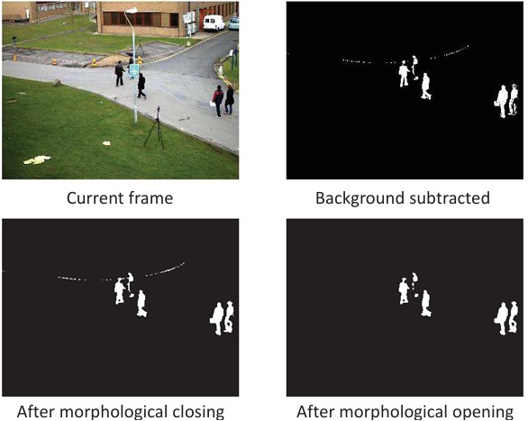
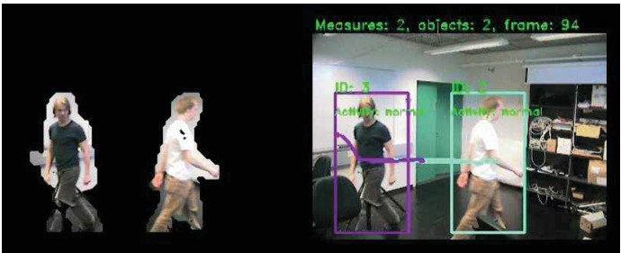
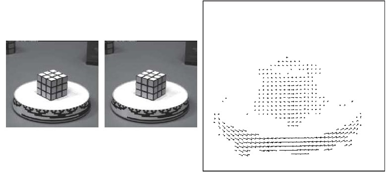
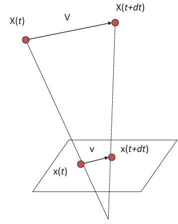
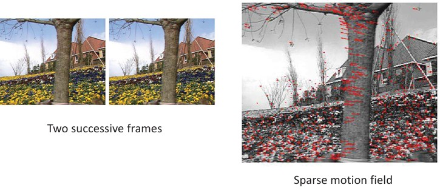
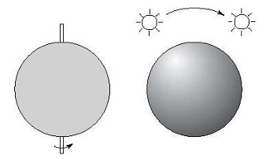
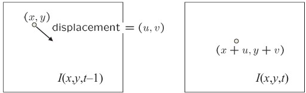

## Foreground Detection & Optical Flow Intro s. 122–126

pics 123a 123b 124a 124b 125b 126a 127a 127b

---

### Preview

In this section, we move deeper into **motion-based vision**. We begin with **foreground detection**, which separates moving objects from the background. Then, we transition to **optical flow**, a method for estimating how pixels move across frames. Along the way, we’ll learn about mathematical models like the **brightness constancy constraint**, understand their limitations, and explore how they are applied in practice.

This section is crucial because **foreground detection and optical flow are building blocks of video understanding**. They enable applications like surveillance, tracking, 3D reconstruction, and even modern deep learning architectures.

---

### Mixture of Gaussian: example

The Mixture of Gaussians (MOG) method models the background as a statistical distribution. Each pixel is represented by a mixture of Gaussian distributions, allowing the model to adapt to changes such as swaying trees, rippling water, or gradual illumination shifts.

* **Current frame (top-left):** The raw video frame.
* **Background subtracted (top-right):** The initial difference mask, showing moving people in white.
* **After morphological closing (bottom-left):** Small holes inside detected objects are filled.
* **After morphological opening (bottom-right):** Small noise pixels are removed, leaving only clean silhouettes of moving people.

This sequence shows how raw background subtraction is refined into reliable **foreground masks**.

---

### Application: video surveillance

A practical use of motion detection is in **video surveillance**. Many modern cameras already include built-in motion detectors.

* In basic systems: detection stops at foreground masks.
* In advanced systems: detection is followed by **object tracking** and **activity analysis**.

For example, in the image, multiple people are detected, boxed, and tracked across frames, with IDs and behavioral states attached (e.g., “active/normal”).

---

### Motion field

The **motion field** is the projection of real-world 3D scene motion into the 2D image plane.

On the left, a cube rotates on a turntable. On the right, the corresponding **motion field vectors** (arrows) show how image pixels shift.

Each arrow indicates **how one pixel moves between frames**, giving a local motion direction and magnitude.

---

### Motion field and parallax

Let’s formalize the motion field.

* A 3D point: \$X(t)\$
* Velocity of that point: \$\mathbf{V} = \frac{dX}{dt}\$
* Projection into the image: \$x(t) = (x(t), y(t))\$

The apparent velocity \$\mathbf{v}\$ in the image has two components:

$$
v_x = \frac{dx}{dt}, \quad v_y = \frac{dy}{dt}
$$

Together, these form the **motion field of the image**.

This concept links 3D motion with its 2D projection, also explaining **motion parallax** (objects at different depths moving at different speeds).

---

### Motion estimation

Two main families of methods are used for motion estimation:

1. **Feature-based methods**

   * Detect features like corners or textured patches.
   * Track them across frames.
   * Produce **sparse but robust motion fields**.
   * Best when motion is large (tens of pixels).

2. **Direct methods**

   * Use image brightness variations directly.
   * Estimate motion parameters without explicit feature matching.
   * Produce **dense motion fields** (motion for every pixel).
   * More sensitive to appearance changes.
   * Work best for small pixel displacements (< 10 pixels).

---

### Feature-based motion estimation: example

This example shows how **SIFT features** are matched between frames.

* On the left: two consecutive frames of a scene.
* On the right: **motion vectors (red lines)** connecting matched feature points.

The **ratio test** helps eliminate ambiguous matches, resulting in a **sparse motion field** that highlights reliable correspondences.

---

### Optical flow

Optical flow is the **apparent motion of brightness patterns in the image**.

* Ideally, optical flow = true motion field.
* In practice, optical flow can differ because brightness changes may occur without actual motion (e.g., a light turning on).

Example:

* A rotating sphere under fixed lighting looks identical to a stationary sphere with moving lighting.
* This illustrates how **apparent motion can mislead** optical flow.

---

### Estimating optical flow

We estimate optical flow by comparing **two consecutive frames**:

$$
I(x,y,t-1) \quad \rightarrow \quad I(x,y,t)
$$

We want to find displacement \$(u(x,y), v(x,y))\$.

Key assumptions:

1. **Brightness constancy** – pixel brightness stays the same over time.
2. **Small motion** – points move only slightly between frames.
3. **Spatial coherence** – neighboring points move similarly.

These assumptions make optical flow estimation tractable.

---

### The brightness constancy constraint

The core equation:

$$
I(x,y,t-1) = I(x+u(x,y), y+v(x,y), t)
$$

Using a Taylor expansion:

$$
I(x,y,t-1) \approx I(x,y,t) + I_x \cdot u(x,y) + I_y \cdot v(x,y) + I_t
$$

Which leads to the **brightness constancy constraint equation**:

$$
I_x \cdot u + I_y \cdot v + I_t \approx 0
$$

This simple but powerful relation is the basis of optical flow estimation.

---

### The brightness constancy constraint (interpretation)

* Each pixel provides **1 equation** but has **2 unknowns** \$(u, v)\$.
* Therefore, the system is **underdetermined** – we need extra assumptions.

Interpretation:

$$
\nabla I \cdot (u,v) + I_t = 0
$$

* The constraint only tells us about the **component of motion along the image gradient**.
* The perpendicular component is unknown → known as the **aperture problem**.

In the picture, multiple solutions for \$(u,v)\$ exist along the edge direction. This explains why **edges are ambiguous for motion estimation**.

---

### Recap

* **Foreground detection** relies on background modeling and subtraction.
* **Mixture of Gaussians (MOG)** provides adaptive background models.
* **Motion field** describes how 3D motion projects into 2D.
* **Feature-based vs. direct methods** estimate motion differently.
* **Optical flow** uses brightness constancy but suffers from the aperture problem.

---

### Reflective Question

If the brightness constancy equation alone cannot uniquely determine optical flow, what additional assumptions or techniques could we use to make the problem solvable?

---

