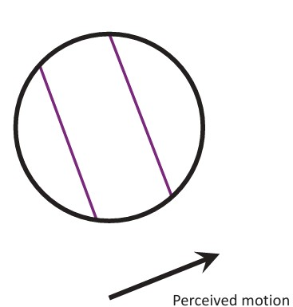
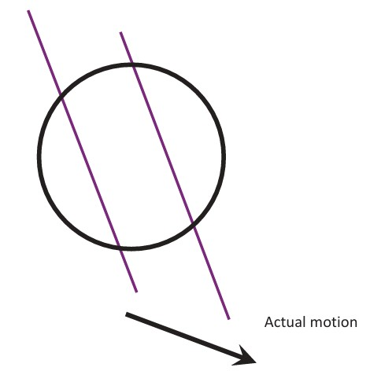
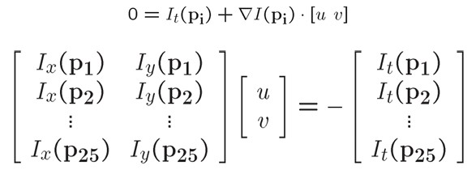
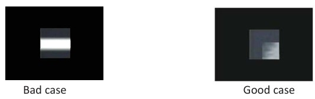

## 31a  Lucas–Kanade Optical Flow (part 1)

### Preview

In this section, we dive into one of the most widely used methods for estimating **optical flow**: the **Lucas–Kanade method**. This technique solves the *aperture problem* by incorporating spatial information across neighboring pixels and framing the solution as a **least squares problem**. We will start with the limitations of observing motion through small image windows, explore perceptual illusions (like the barber pole effect), and then step into the mathematics of the Lucas–Kanade flow algorithm. By the end, you’ll understand how local motion estimation works in practice and why it is so effective in computer vision.

---

### The aperture problem

The **aperture problem** arises when we try to estimate motion by looking only through a small local window (or aperture).

* Imagine observing a diagonal line through a circular aperture.
* Locally, we cannot determine whether the line is moving diagonally, horizontally, or vertically — only its motion *perpendicular to the edge* is visible.
* Thus, the **perceived motion** may not equal the **actual motion** of the edge.

This creates ambiguity in optical flow estimation.

---

### The barber pole illusion

The **barber pole illusion** is a perceptual example of the aperture problem. The stripes on the pole move diagonally, but when viewed through the rectangular aperture of the pole, the human brain interprets the motion as mostly vertical.

This illustrates how motion perception can be biased by the shape of the viewing aperture.

[Barber pole illusion – Wikipedia](http://en.wikipedia.org/wiki/Barberpole_illusion)

---

### Solving the aperture problem

To resolve the aperture problem, we need **more equations per pixel**.

* One way is to assume **spatial coherence**: neighboring pixels in a small window share the same motion vector \$(u,v)\$.
* For example, in a \$5 \times 5\$ window, we collect 25 equations.

The basic equation is:

$$
0 = I_t(p_i) + \nabla I(p_i) \cdot 
\begin{bmatrix} u \\ v \end{bmatrix}
$$

Stacking these equations leads to the system:

$$
\begin{bmatrix}
I_x(p_1) & I_y(p_1) \\
I_x(p_2) & I_y(p_2) \\
\vdots & \vdots \\
I_x(p_{25}) & I_y(p_{25})
\end{bmatrix}
\begin{bmatrix}
u \\ v
\end{bmatrix}
=
-
\begin{bmatrix}
I_t(p_1) \\
I_t(p_2) \\
\vdots \\
I_t(p_{25})
\end{bmatrix}
$$

---

### Least squares formulation

The system above is often **overdetermined** (more equations than unknowns). We solve it using **least squares minimization**.

This is expressed as:

$$
A d = b, \quad A \in \mathbb{R}^{25 \times 2}, \ d \in \mathbb{R}^{2 \times 1}, \ b \in \mathbb{R}^{25 \times 1}
$$

where $d = [u \ v]^T$ is the flow vector.

* If the window contains **only one edge**, the system may not be solvable → bad case.
* If the window contains **corners or textured regions**, then we have enough independent information to solve for \$(u,v)\$ → good case.

---

### Lucas–Kanade flow

Finally, the **Lucas–Kanade method** solves the least squares problem in closed form:

$$
(A^T A) d = A^T b
\quad \Rightarrow \quad
\hat{d} = (A^T A)^{-1} A^T b
$$

Written explicitly:

$$
\begin{bmatrix}
\sum I_x I_x & \sum I_x I_y \\
\sum I_x I_y & \sum I_y I_y
\end{bmatrix}
\begin{bmatrix}
u \\ v
\end{bmatrix}
=
-
\begin{bmatrix}
\sum I_x I_t \\
\sum I_y I_t
\end{bmatrix}
$$

* The matrix \$A^T A\$ is based on image gradients.
* The solution requires that \$A^T A\$ is invertible (which happens if the region has **enough texture/corners**).
* The method is efficient and widely used in **tracking** and **video analysis**.

---

### Recap

* The **aperture problem** makes motion estimation ambiguous if we only look at one edge.
* The **Lucas–Kanade method** solves this by assuming local spatial coherence and using least squares.
* The method works best on regions with strong corners/textures (not flat regions or straight edges).

---

### Reflective Question

👉 Why does the Lucas–Kanade method fail on flat or low-texture regions, and what strategies could we use to overcome this limitation?

---

