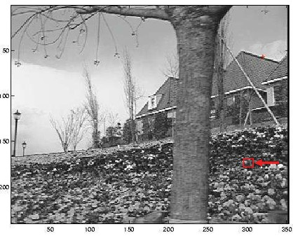
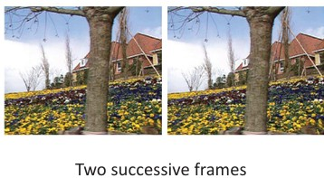
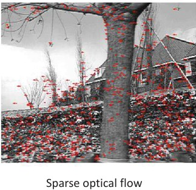
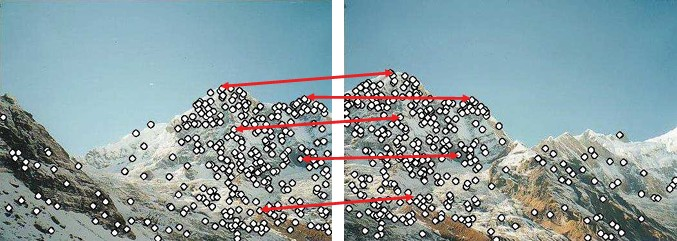
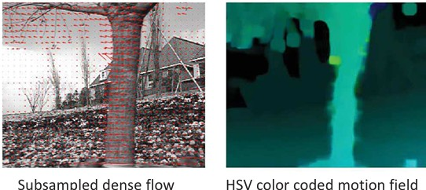
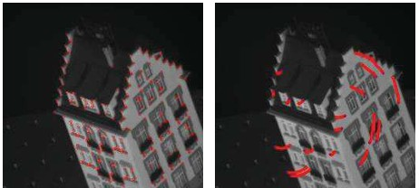
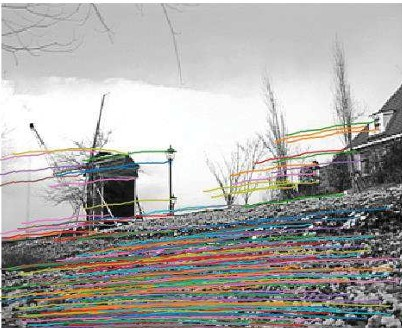
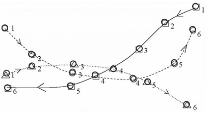

## 32  Dense Flow & Tracking s. 132–136
<!--
### High-texture or corner region 133

### Selecting the features \* 133

### Errors in Lucas-Kanade 134

### Optical flow vs. feature matching 134
### Dense optical flow* 135
### Feature tracking 135
### Tracking challenges 136

### Tracking over many frames 136

### Feature tracking: example \* 137

### Computing the paths of moving points 137
-->

### Preview  
In this section, we look at how computers **track motion** in videos. We learn why some points (corners) are easier to follow, how to select good features, what can go wrong, and how to track objects over many frames. Both **sparse flow** (few points) and **dense flow** (all pixels) are explained.  

---

### High-texture or corner region  
  

- Corners and textured areas have **gradients in many directions**.  
- Both eigenvalues are large: $ \lambda_1, \lambda_2 \gg 0 $.  
- These regions are **well-conditioned** → stable for tracking.  

**Why this matters:**  
Corners stay unique when the camera moves, unlike flat regions or straight edges. They are the best candidates for tracking.  

---

### Selecting the features  
   

- Shi–Tomasi rule for good features:  

  $$
  \min(\lambda_1, \lambda_2) > T

  $$  

  (both directions must be strong enough, above threshold $T$).  
- Ensures only **robust corners** are chosen.  
- Example: red dots mark good tracking points in two successive frames.  

**Why this matters:**  
Not all pixels are useful. Shi–Tomasi selects only the ones that can be followed reliably across frames.  

---

### Errors in Lucas–Kanade  
  

Problems can occur:  
- **Motion too large** (> 1 pixel) → fix with multi-scale or feature matching.  
- **Point moves differently from its neighbors** → use motion segmentation.  
- **Brightness changes** (lighting not constant) → use normalized correlation.  

Equation for normalized correlation:  

$$

\frac{1}{n} \sum_{x,y} \frac{(f(x,y)-\bar f)(t(x,y)-\bar t)}{\sigma_f \, \sigma_t}
$$  

**Why this matters:**  
Lucas–Kanade works best with small, smooth motion and stable lighting.  

---

### Optical flow vs. feature matching  
  

- **Lucas–Kanade / correlation:**  
  - Fast, works if motion is small.  
  - Needs high frame rate.  
- **Feature descriptors (e.g. SIFT):**  
  - Handles large changes and deformations.  
  - Slower and more expensive.  

**Why this matters:**  
For fast videos (like webcams), Lucas–Kanade is enough. For large viewpoint changes, descriptors like SIFT are better.  

---

### Dense optical flow  
  

- Sparse flow = tracks only selected points.  
- Dense flow = tracks **every pixel**.  
- Needs smoothness assumptions to solve.  
- Example: Farnebäck’s method (2003).  

Images:  
- Left: dense flow arrows.  
- Right: HSV color-coded flow field.  

**Why this matters:**  
Dense flow gives full motion information, but is heavier to compute.  

---

### Feature tracking  
  

- Optical flow can be extended to many frames.  
- A point can be followed across frames → **trajectory**.  
- Simple idea: just follow the arrows.  

---

### Tracking challenges  
  

- **Ambiguity:** not all points are good → choose corners.  
- **Large motion / occlusions:** need to add/remove features.  
- **Drift:** errors accumulate → must stop or reset tracking.  

---

### Tracking over many frames  
- Start: pick features in the first frame.  
- Then, for each frame:  
  - Update feature positions.  
  - Remove inconsistent tracks.  
  - Add new features if needed.  

---

### Feature tracking: example  
  

- Lucas–Kanade was used to track features.  
- Many points stayed tracked over **100 frames**.  
- Colored lines show trajectories.  

---

### Computing the paths of moving points  
  

- Hard to track if many objects overlap.  
- Simplify with assumptions:  
  - Objects move smoothly.  
  - Velocity changes smoothly.  
  - One object = one location at a time.  
  - Two objects cannot be in the same place.  

- Definition of a trajectory:  

  $$
  T_i = (p_{i,1}, p_{i,2}, …, p_{i,n})

  $$  

**Why this matters:**  
Tracking is about building consistent paths (trajectories) for objects over time.  

---

### Recap  
- **Corners** are the best features to track.  
- Lucas–Kanade is simple and fast, but assumes **small smooth motion**.  
- **Dense flow** tracks all pixels, useful but heavier.  
- Long-term tracking needs to handle occlusions, drift, and feature replacement.  
- A trajectory is the path of an object across frames.  

---

### Stop to think  
If you were building a video app that tracks people moving in a room, would you choose **sparse tracking of corners** (fast, light) or **dense optical flow** (detailed, heavy)? Why?  

