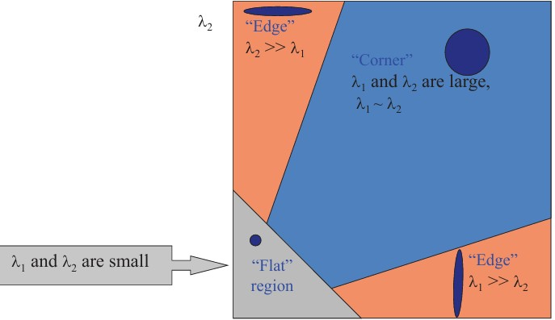
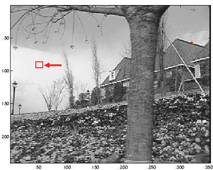
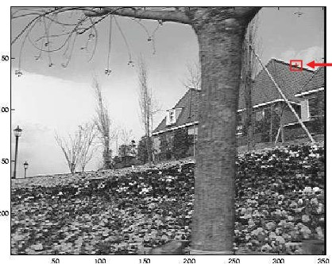

## 31b Lucas–Kanade Optical Flow (part 2)

pics 131b 132a 132b

---

### Preview

In this section, we extend our understanding of the Lucas–Kanade optical flow method by examining **when and why it works**. The key lies in the **second moment matrix**, which connects to concepts we already encountered with the **Harris corner detector**. By studying eigenvalues of this matrix, we can classify regions of an image (flat, edge, or corner) and determine whether the optical flow problem is well-posed. This is crucial for designing robust motion estimation systems.

---

### Lucas–Kanade flow and the second moment matrix

The Lucas–Kanade system can be written as:

$$
\begin{bmatrix}
\sum I_x I_x & \sum I_x I_y \\
\sum I_x I_y & \sum I_y I_y
\end{bmatrix}
\begin{bmatrix}
u \\ v
\end{bmatrix}
=
-\begin{bmatrix}
\sum I_x I_t \\
\sum I_y I_t
\end{bmatrix}
$$

This matrix on the left is \$A^TA\$, also known as the **second moment matrix** \$M\$.

* This is the same matrix we encountered in the **Harris corner detector**.
* Whether the system has a unique solution depends on the **eigenvalues of \$M\$**.

Key points:

* **Eigenvectors** give the direction of image gradient change.
* **Eigenvalues** tell us how strong those changes are.
* If one eigenvalue is large and the other small → an **edge**.
* If both are large → a **corner**.
* If both are small → a **flat region**.

---

### Interpreting the eigenvalues

Classification of image regions using eigenvalues:

* **Flat region**: both $\lambda\_1$ and $\lambda\_2$ are small → no significant gradient → flow cannot be estimated.
* **Edge**: one eigenvalue is large, the other is small ($\lambda\_1 \gg \lambda\_2$ or vice versa) → flow is ambiguous perpendicular to the edge.
* **Corner**: both eigenvalues are large and of similar size ($\lambda\_1 \sim \lambda\_2$) → good for motion estimation.

This diagram summarizes how eigenvalue combinations map to region types.

---

### Uniform region example

In a uniform (flat) region of the image:

* Gradients have very small magnitude.
* $\lambda\_1$ and $\lambda\_2$ are both small.
* The system is **ill-conditioned**, meaning there isn’t enough information to reliably compute motion.

---

### Edge region example

In an edge region of the image:

* Gradients have one dominant direction.
* One eigenvalue is large, the other small.
* The system is again **ill-conditioned** because motion along the edge direction cannot be distinguished from other possibilities (aperture problem).

---

### Recap

* The Lucas–Kanade method relies on the **second moment matrix**.
* Eigenvalues of this matrix determine if motion estimation is possible.
* **Corners** are the best places to track motion, because they provide strong, unambiguous gradients in two directions.
* **Edges** and **flat regions** make the system ill-conditioned, leading to unreliable flow estimates.

---

### Reflective Question

Why do you think corners provide more reliable motion estimates than edges or flat regions? Can you connect this to the **aperture problem** we studied earlier?

