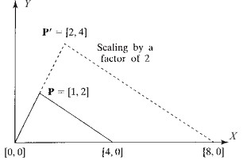
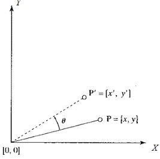
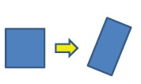
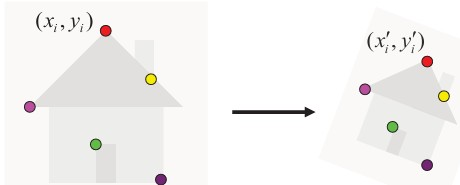

## 36b Image Alignment & Affine Mapping (part 2) s. 157–159
<!---
### Affine mapping 158

### Affine mapping 159
### Fitting an affine transformation 160

-->

### Preview
In this section, we deepen our understanding of **affine mapping**. We explore how scaling, rotation, translation, shear, and reflection can be combined to form general affine transformations. We also see how these transformations can be estimated from point correspondences using linear algebra and least squares. By the end, you will be able to both understand and compute affine mappings, as well as appreciate their flexibility in modeling geometric transformations.  

---

### Affine mapping: General form
An affine transformation has the form  

  $$
  T(\mathbf{x}) = A\mathbf{x} + \mathbf{b},
  $$

where:  
- $A$ is a **linear transformation matrix** (describing scaling, rotation, shear, reflection),  
- $\mathbf{b}$ is a **translation vector**.  

Using **homogeneous coordinates**, this can be written as:  

$$

\begin{bmatrix}
x' \\ 
y' \\ 
1
\end{bmatrix}
=
\begin{bmatrix}
A & \mathbf{b} \\
0 & 1
\end{bmatrix}
\begin{bmatrix}
x \\ 
y \\ 
1
\end{bmatrix}
=
\begin{bmatrix}
a_{11} & a_{12} & a_{13} \\
a_{21} & a_{22} & a_{23} \\
0 & 0 & 1
\end{bmatrix}
\begin{bmatrix}
x \\ 
y \\ 
1
\end{bmatrix}
$$

  
*Scaling of a point $(1,2)$ to $(2,4)$ by a factor of 2.*  

---

### Scaling
Scaling is represented by  

$$
A = \begin{bmatrix}
c_x & 0 \\
0 & c_y
\end{bmatrix}, \quad 
\mathbf{b} = \begin{bmatrix} 0 \\ 0 \end{bmatrix}
$$  

where $c_x$ and $c_y$ are the horizontal and vertical scaling factors.  
- **Uniform scaling:** $c_x = c_y$ (same factor in both directions).  
- **Non-uniform scaling:** $c_x \neq c_y$.  

---

### Rotation and Translation
**Rotation** by angle $\theta$:  

$$
A = \begin{bmatrix}
\cos\theta & -\sin\theta \\
\sin\theta & \cos\theta
\end{bmatrix}, \quad 
\mathbf{b} = \begin{bmatrix} 0 \\ 0 \end{bmatrix}
$$  

**Translation** by $(x_0, y_0)$:  

$$
A = \begin{bmatrix}
1 & 0 \\
0 & 1
\end{bmatrix}, \quad 
\mathbf{b} = \begin{bmatrix} x_0 \\ y_0 \end{bmatrix}
$$  

  
*Rotation by angle $\theta$ around the origin.*  

**Rigid transformations** combine rotation + translation, preserving distances between points.  
- If $A$ is **orthogonal** (columns are perpendicular unit vectors), then the transformation preserves lengths and angles.  
- If $A$ is **orthonormal** (orthogonal + unit vectors), then the transformation is pure rotation/reflection.  

---

### RST Transformation (Rotation, Scaling, Translation)
In many practical cases, transformations are composed of **rotation, scaling, and translation (RST)**.  

The RST transformation is:  

$$
\begin{bmatrix}
x' \\ y' \\ 1
\end{bmatrix}
=
\begin{bmatrix}
1 & 0 & x_0 \\
0 & 1 & y_0 \\
0 & 0 & 1
\end{bmatrix}
\begin{bmatrix}
c_x & 0 & 0 \\
0 & c_y & 0 \\
0 & 0 & 1
\end{bmatrix}
\begin{bmatrix}
\cos\theta & -\sin\theta & 0 \\
\sin\theta & \cos\theta & 0 \\
0 & 0 & 1
\end{bmatrix}
\begin{bmatrix}
x \\ y \\ 1
\end{bmatrix}
$$  

Simplified:  

$$
\begin{bmatrix}
x' \\ y' \\ 1
\end{bmatrix}
=
\begin{bmatrix}
c_x \cos\theta & -c_x \sin\theta & x_0 \\
c_y \sin\theta & c_y \cos\theta & y_0 \\
0 & 0 & 1
\end{bmatrix}
\begin{bmatrix}
x \\ y \\ 1
\end{bmatrix}
$$  

- General case: 5 parameters ($c_x, c_y, \theta, x_0, y_0$).  
- Often simplified to **4 parameters** with uniform scaling $c_x = c_y = c$.  
- Parameters can be estimated from **at least 4 point correspondences** $(x, y) \mapsto (x', y')$.  

  

---

### Shear and Reflection
**Shear**: shifts coordinates in proportion to another axis.  

Shear along $x$:  

  $$
  A = \begin{bmatrix} 1 & e_x \\ 0 & 1 \end{bmatrix}
  $$

Shear along $y$:  

  $$
  A = \begin{bmatrix} 1 & 0 \\ e_y & 1 \end{bmatrix}
  $$

**Reflection**: flips across an axis.  

Reflection in $x$:  

  $$
  A = \begin{bmatrix} 1 & 0 \\ 0 & -1 \end{bmatrix}
  $$

Reflection in $y$:  

  $$
  A = \begin{bmatrix} -1 & 0 \\ 0 & 1 \end{bmatrix}
  $$

  

**General affine transformation**:  

$$
\begin{bmatrix}
x' \\ y' \\ 1
\end{bmatrix}
=
\begin{bmatrix}
a_{11} & a_{12} & a_{13} \\
a_{21} & a_{22} & a_{23} \\
0 & 0 & 1
\end{bmatrix}
\begin{bmatrix}
x \\ y \\ 1
\end{bmatrix}
$$  

- Includes 6 parameters.  
- Requires at least **3 non-colinear point correspondences** to estimate.  

---

### Fitting an affine transformation
Affine transformations can be computed from point correspondences using a **linear system**.  

We express the transformation constraints as:  

$$
M \mathbf{x} = \mathbf{b}
$$  

with $M$ built from source points and $\mathbf{b}$ from target points.  

The solution is obtained with **least squares estimation**:  

$$
\hat{\mathbf{x}} = (M^T M)^{-1} M^T \mathbf{b}
$$  

  

This gives the best-fit affine parameters when data is noisy or overdetermined.  

---

### Recap
- Affine transformations generalize geometric mappings by combining **scaling, rotation, translation, shear, and reflection**.  
- They can be expressed compactly in homogeneous coordinates.  
- RST transformations are a common special case.  
- Parameters can be estimated from point correspondences using **linear least squares**.  

---

### Reflective question
Why do affine transformations require at least **3 non-colinear point correspondences** for estimation, and what happens if the points are colinear?

