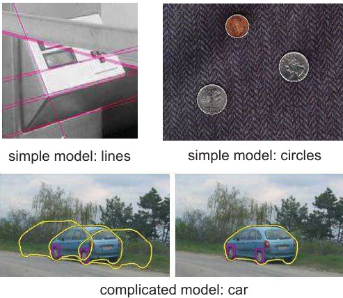
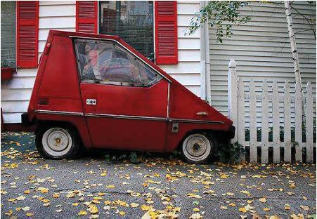
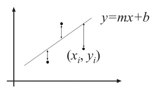
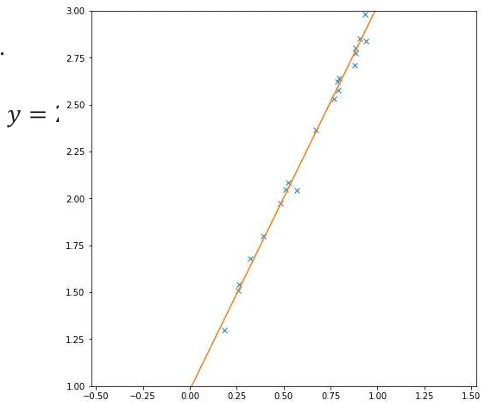
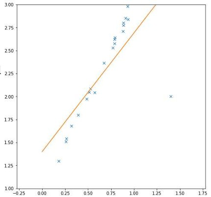

## 34 Model Fitting Basics  

### Preview  
In this section, we learn how **geometric models** (like lines, circles, ellipses) can be fitted to image features. We look at practical issues (noise, outliers, missing data) and see how **least squares fitting** works, along with its limitations.  

---

### Object models  
  

- Objects in 2D images can be approximated by **geometric models**.  
- These models are often described by **mathematical equations**.  
- Parameters define properties like **size, position, orientation**.  
- Examples of simple parametric models:  
  - Point  
  - Line  
  - Circle  
  - Ellipse  

**Explanation:**  
A line is defined by slope and intercept, a circle by radius and center, etc. Complex objects can be built from these simpler building blocks.  

---

### Model fitting  
  

- Fitting means choosing a **parametric model** that explains a set of image features.  
- Simple examples:  
  - Lines fitted to edges in an image.  
  - Circles fitted to coin outlines.  
- More complex example:  
  - A car model fitted to the outline of vehicles.  

**Explanation:**  
The better the fit, the closer the model matches the observed data. Sometimes simple models are enough; for real objects, more detailed models are needed.  

---

### Fitting: Issues (case study: Line detection)  
  

Problems that occur when fitting models to data:  
- **Noise** in measurements (detected points not exact).  
- **Extraneous data** (outliers, clutter, multiple overlapping features).  
- **Missing data** (occlusion, parts of the object hidden).  

**Explanation:**  
In real-world images, lines may be broken, occluded, or mixed with irrelevant edges. Robust methods are needed to handle this.  

---

### Fitting: Issues (continued)  
  

- How do we find the **optimal line** parameters?  
  - Use **least squares**.  
- What if there are **outliers**?  
  - Use robust fitting, e.g. **RANSAC**.  
- What if there are **many lines**?  
  - Use voting-based methods like **RANSAC** or the **Hough transform**.  
- What if we’re not even sure it’s a line?  
  - Use **model selection** techniques.  

---

### Least squares line fitting  
  

- Suppose we have data points $(x_1,y_1), …, (x_n,y_n)$.  
- Line equation: $y_i = m x_i + b$.  
- Goal: minimize the squared error  

$$
E = \sum_{i=1}^{n} (y_i - m x_i - b)^2
$$  

- Matrix form leads to the **normal equations**:  

$$
X^T X B = X^T Y
$$  

with solution  

$$
\hat{B} = (X^T X)^{-1} X^T Y
$$  

**Explanation:**  
This method finds the line that best fits the data by minimizing the total squared vertical distance between points and the line.  

---

### Least squares line fitting: example  
  

- LS can handle measurement **noise**.  
- Example: estimated line closely follows noisy data.  
- True line: $y = 2x + 1$.  
- Estimated line is close to this.  

**Explanation:**  
Even with noisy points, LS provides a stable approximation.  

---

### Least squares line fitting: example (outliers)  
  

- Problem: even a **single outlier** can distort the line fit.  
- Example: estimated line becomes $y = 1$.  
- Reason: squared errors give too much weight to outliers.  

**Explanation:**  
Least squares is not robust — alternative methods (e.g., RANSAC) are better when outliers are expected.  

---

### Recap  
- Geometric **object models** approximate shapes in images.  
- **Model fitting** finds the best match between data and a parametric model.  
- Real images cause problems: **noise, outliers, occlusions**.  
- **Least squares fitting** is simple and effective with noise, but fails with outliers.  
- More robust methods like **RANSAC** are needed in messy real-world data.  

---

### Stop to think  
Imagine you are fitting a line to noisy traffic lane markings. What problems might occur if cars or shadows create **outliers** in your data, and how would you handle them?  

