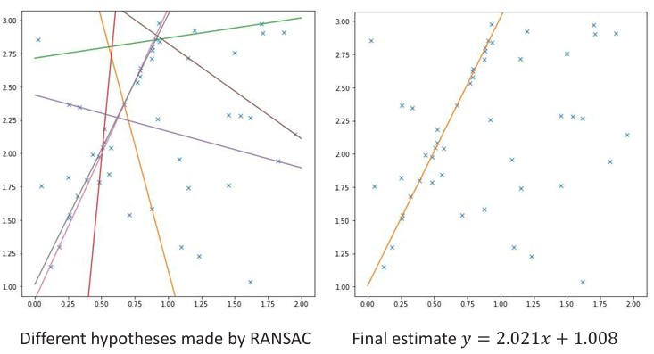
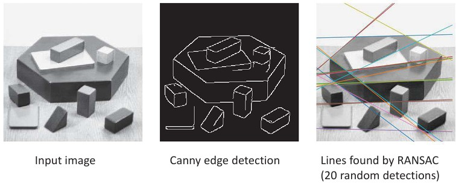

## 35a RANSAC & Hough Transform (part 1)

### Preview
In this section, you’ll learn how to fit models when there are **outliers**. We introduce **RANSAC (Random Sample Consensus)** and connect it to **voting-based methods** (the idea behind the Hough transform). You’ll see the algorithm, the math for choosing parameters, and a quick pros/cons check.

---

### RANSAC  

**Idea:** Fit a model robustly by trying many small, random subsets.

**Algorithm outline**
1. Randomly choose a small subset of points.  
2. Fit a model to this subset.  
3. Test all other points: points close to the model are **inliers**; others are **outliers**.  
4. Repeat many times and keep the model with the most inliers.

**Why it works:** With enough trials, at least one subset is outlier‑free, giving a good initial model that the inliers support.

---

### RANSAC for line fitting  

**Steps**
1. Repeat for $N$ iterations:  
   - Draw $s$ points at random.  
   - Fit a line to these $s$ points.  
   - Mark other points as inliers if their distance to the line is $< t$.  
2. If at least $d$ inliers are found, refit the line using **all** inliers.  
3. Keep the line with the largest inlier set.

Example outcome (after iterations): best line $\;y \approx 2.021x + 1.008\;$ despite outliers.

---

### Choosing the parameters

- **Sample size $s$**: minimum points to define the model (e.g., $s=2$ for a line).  
- **Inlier threshold $t$**: distance tolerance (related to expected noise).  
- **Iterations $N$**: chosen so that with probability $p$ at least one random sample is outlier‑free when the outlier ratio is $e$.

Probability relation:

$$
\big(1 - (1-e)^s\big)^N = 1 - p

$$

Solve for $N$:

$$

N = \frac{\log(1-p)}{\log\!\big(1-(1-e)^s\big)}

$$

**Reference table (required $N$ vs. outlier ratio $e$)**

| $s$ | 5% | 10% | 20% | 25% | 30% | 40% | 50% |
|---:|---:|----:|----:|----:|----:|----:|----:|
| 2 | 2 | 3 | 5 | 6 | 7 | 11 | 17 |
| 3 | 3 | 4 | 7 | 9 | 11 | 19 | 35 |
| 4 | 3 | 5 | 9 | 13 | 17 | 34 | 72 |
| 5 | 4 | 6 | 12 | 17 | 26 | 57 | 146 |
| 6 | 4 | 7 | 16 | 24 | 37 | 97 | 293 |
| 7 | 4 | 8 | 20 | 33 | 54 | 163 | 588 |
| 8 | 5 | 9 | 26 | 44 | 78 | 272 | 1177 |

---

### Pros and cons of RANSAC

**Pros**
- Simple, general, and often works well.  
- Robust to many outliers.

**Cons**
- Parameters $s$, $t$, and $N$ must be tuned.  
- May need many iterations.  
- Can fail when the inlier ratio is extremely low.

---

### Voting schemes (link to Hough transform)

- Let each feature **vote** for all compatible models.  
- True models collect many consistent votes; random noise does not.  
- Missing data is tolerable if enough features vote similarly.

*This is the core idea behind the Hough transform (covered next).*

---

### Recap
- RANSAC fits models by sampling, testing inliers, and keeping the best‑supported model.  
- Key knobs: $s$ (sample size), $t$ (inlier threshold), $N$ (iterations).  
- Robust in practice but can be slow if mis‑tuned or when inliers are scarce.  
- Voting approaches offer an alternative viewpoint leading to the Hough transform.

---

### Stop to think
You’re detecting lane lines with shadows, cracks, and cars creating outliers. How would you pick $t$, $s$, and $N$ to balance **accuracy** and **speed** in RANSAC?

