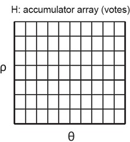
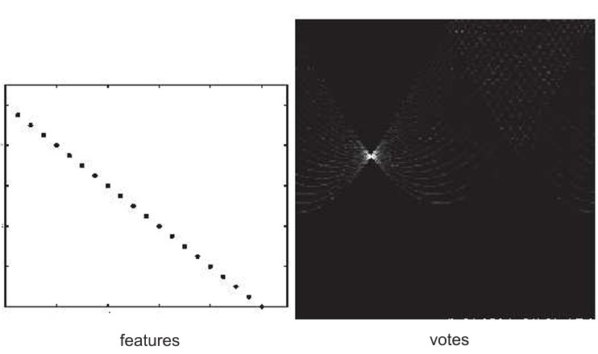
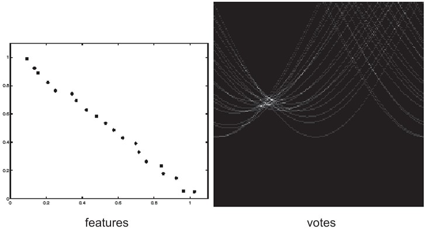
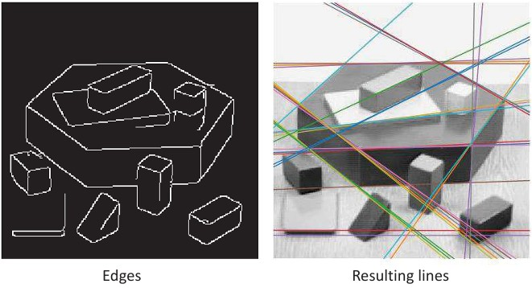
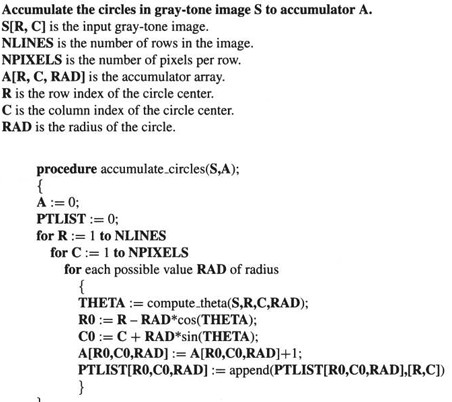
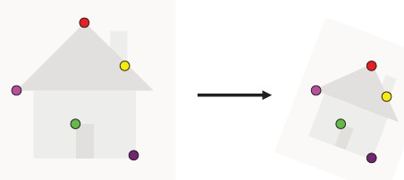

## 35b-2 RANSAC & Hough Transform (part 2)

### Preview

In this part, we focus on **practical challenges of the Hough transform** and its **extensions**. We see how noise affects detection, how to refine results, and how the method can be generalized from straight lines to circles and even arbitrary shapes. Finally, we look at how the Hough transform relates to **image alignment**.

---

### Exact match

If all detected points lie perfectly on a line, the Hough transform produces a **sharp peak** in the parameter space.
This peak corresponds to the exact parameters (slope and intercept, or \$\theta\$ and \$\rho\$) of the line.

---

### Effect of noise

When the input data contains **noise** (extra or slightly misplaced points), the peak in parameter space becomes **fuzzy**.
Instead of a single sharp maximum, many nearby bins receive votes, making it harder to localize the line.

---

### Dealing with noise

To make the Hough transform more robust, several strategies are used:

* **Choose a good discretization grid:**
  *Too coarse* → many different lines collapse into one bin.
  *Too fine* → a true line gets split into separate bins.
* **Smooth the accumulator array:** increment neighboring bins to reduce sensitivity to small errors.
* **Filter irrelevant points:** only let edge points with strong gradient magnitude vote.

---

### Finding lines with Hough transform: example

The Hough transform can detect multiple straight lines in an image.

1. Start with **edge detection** (e.g., Canny).
2. Apply the Hough transform to vote for possible lines.
3. Select peaks in the accumulator array as the most likely lines.

The result shows the detected edges overlaid with the corresponding lines.

---

### Finding circles

The Hough transform can also detect **circles** (and other curves).
A circle is defined by three parameters:

* **\$d\$**: radius
* **\$r\_0\$**: row coordinate of the center
* **\$c\_0\$**: column coordinate of the center

The equations are:

$$

r = r_0 + d \sin \theta, \qquad c = c_0 - d \cos \theta
$$

If a point lies on a circle, its gradient points toward the circle’s center.

---

### Finding circles: algorithm

The algorithm for circle detection is an extension of the line case:

1. Initialize a 3D accumulator array \$A\[r, c, d]\$ (center coordinates + radius).
2. For each edge point, cast votes for all possible circle centers and radii.
3. Peaks in the accumulator correspond to detected circles.

The pseudocode shows how votes are accumulated.

---

### Hough transform: extensions

The Hough transform is not limited to lines or circles.
It can be applied to **any curve** that can be expressed analytically:

$$
f(x, \mathbf{a}) = 0
$$

where \$x\$ is a pixel and \$\mathbf{a}\$ is a set of parameters.

Generalized procedure:

1. Initialize accumulator \$A\[\mathbf{a}]\$.
2. For each edge pixel, determine parameter values \$\mathbf{a}\$ that fit.
3. Increment corresponding bins.

This enables detecting **arbitrary shapes** defined by boundary points.

---

### Image alignment

The Hough transform concepts also connect to **image alignment**, where the goal is to align two images of the same scene.

Two strategies:

* **Direct (pixel-based):** look for transformation that maximizes pixel agreement.
* **Feature-based:** align based on extracted features (corners, edges, etc.), then verify with pixel-based checks.

---

### Recap

* Exact matches give sharp peaks, but **noise makes peaks fuzzy**.
* Solutions: careful discretization, smoothing, and filtering irrelevant points.
* The Hough transform can find **lines, circles, and more general curves**.
* The method extends beyond shape detection, helping with **image alignment** too.

---

### Stop to think

Why does adding **one more parameter** (like radius for circles) make the Hough transform more computationally expensive, and how could you balance accuracy with efficiency?

---

<!-- OBSOLETE, EI TEHDÄ JAETTU KAHTIA YLLÄ
