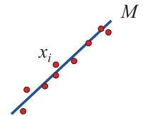
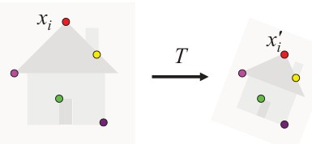
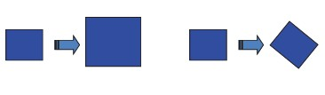
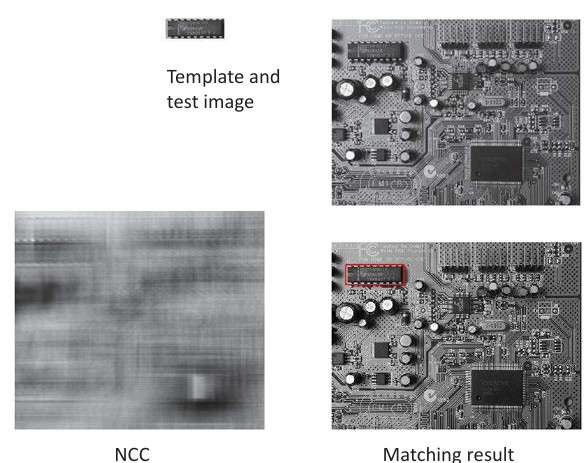
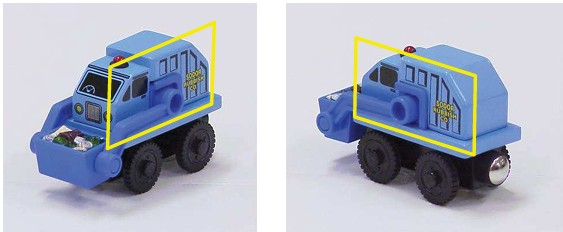

## 36a  Image Alignment & Affine Mapping (part 1) s. 154–156
<!--
### Alignment as fitting 155

### 2D transformation models 155

### Template matching 156

### Template matching: example \* 156

### Affine transformations 157

### Representation of points 157

-->

### Preview
In this section, we study how to align images and describe transformations between them. We will look at alignment as a fitting problem, learn about different 2D transformation models, explore template matching, and finally see why affine transformations and homogeneous coordinates are especially important in computer vision.

---

### Alignment as fitting
  

- **Earlier task:** fitting a model $M$ to features in a single image.  
  - Find $M$ that minimizes the error (residuals) from points $x_i$:  

    $$
    \min_M \sum_i \text{residual}(x_i, M)

    $$

- **Alignment task:** fitting a transformation $T$ between *pairs of features* across two images.  
  - We want to minimize the error between transformed points and their matches:  

    $$

    \min_T \sum_i \text{residual}(T(x_i), x_i')

    $$

*Idea: alignment generalizes model fitting from one image to matching across two images.*

---

### 2D transformation models
  
  

Different models describe how one image relates to another:  

- **Similarity (RST):** includes rotation, scaling, and translation. Shapes are preserved but may be moved, resized, or rotated.  
- **Affine:** allows shearing and stretching. Straight lines remain straight, but parallelism is preserved.  
- **Projective (homography):** most general. Lines remain straight, but parallelism is not preserved. Useful for perspective distortions.  

---

### Template matching

- A direct **pixel-to-pixel comparison** between a template $T(x)$ and a test image $I(x)$.  
- Template is usually smaller than the test image.  
- Matching criteria:  
  - **Sum of Squared Differences (SSD):**  

    $$

    \sum_x (T(x) - I(x + b))^2

    $$

  - **Sum of Absolute Differences (SAD):**  

    $$

    \sum_x |T(x) - I(x + b)|

    $$

  - **Normalized Cross Correlation (NCC):**  

    $$

    \frac{\sum_x T(x) I(x+b)}{\sqrt{\sum_x T(x)^2 \sum_x I(x+b)^2}}

    $$

- $b$ is the translation vector (shift).  
- SSD and SAD are minimized; NCC is maximized.

*Use case: detecting whether a smaller patch (like an object) appears inside a larger image.*

---

### Template matching: example
  

- The small rectangular chip is the **template**.  
- We slide this template across the test image (circuit board).  
- NCC produces a response map where brighter spots mean higher similarity.  
- Final match is found where NCC is maximized (highlighted red box).  

*This illustrates how template matching can find exact object locations, provided scale and rotation are consistent.*

---

### Affine transformations
  

- **Procedure:** fitting affine parameters is a linear least squares problem (easy to solve).  
- **Applications:**  
  - Approximates viewpoint changes for planar objects.  
  - Works well with roughly orthographic cameras.  
  - Serves as a good initialization for more complex models.  
- **Requirement:** correspondences between features (points that should match).  

*Example: a toy car shown from two slightly different angles still aligns via an affine transform.*

---

### Representation of points

- **Cartesian coordinates:** represent 2D points as $P = (x,y)$ or as a vector $P = [x,y]^t$.  
- Transformed point: $P' = [x', y']^t$.  
- **Homogeneous coordinates:**  

  $$

  P = [sx, sy, s]^t, \quad s \neq 0

  $$

  Commonly $s=1$.  
- Homogeneous coordinates simplify handling affine and projective transformations.  
- **Coordinate conventions:**  
  - Drawn figures: $x$ to the right, $y$ upward.  
  - Images: $c$ (columns) to the right, $r$ (rows) downward.  

*Homogeneous coordinates allow translations and perspective mappings to be represented using simple matrix multiplication.*

---

### Recap
- Alignment extends fitting: instead of one image, we now match features between two images.  
- 2D transformation models: similarity, affine, projective.  
- Template matching compares patches directly using SSD, SAD, or NCC.  
- Affine transforms approximate viewpoint changes and are easy to compute.  
- Homogeneous coordinates are crucial for representing transformations compactly.  

---

### Stop to think
Why do you think **homogeneous coordinates** are more convenient than Cartesian coordinates when applying transformations like translation or perspective warps?

