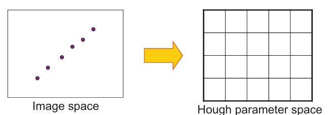
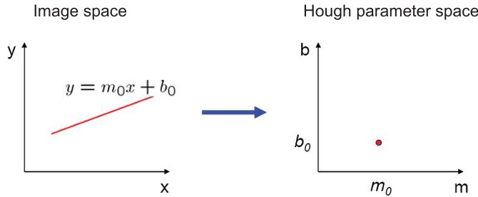
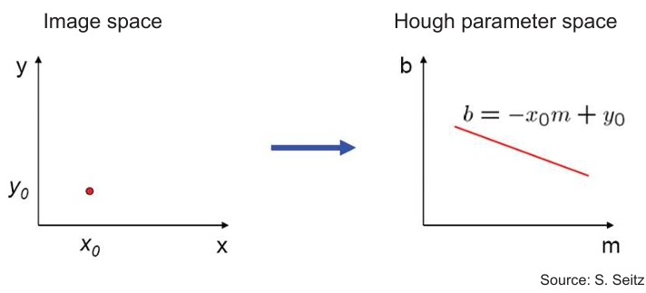
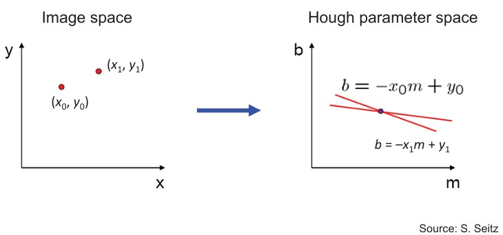
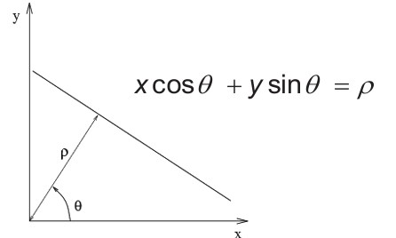

## 35b-1 RANSAC & Hough Transform (part 2, basics)

### Preview
In this part, we introduce the **Hough transform**, one of the most widely used voting-based methods in computer vision. You will learn how it maps image points into a parameter space, how lines and points relate in both spaces, and why the polar form is often preferred. This builds the foundation for detecting lines and other shapes in noisy images.

---

### Hough transform  

- An early type of **voting scheme**.  
- **Steps:**
  1. Discretize the parameter space into bins.  
  2. For each feature point in the image, cast a vote in every bin that could represent a line through that point.  
  3. Find the bins with the most votes → they correspond to the strongest candidate lines.  

*Example: feature points in image space map to peaks in parameter space.*

---

### Parameter space representation (lines to points)  

- A line in image space  

  $$

  y = m_0 x + b_0

  $$

  corresponds to a **single point** $(m_0, b_0)$ in Hough space.  

This shows the duality: lines ↔ points across the two spaces.

---

### Parameter space representation (points to lines)  

- A point $(x_0, y_0)$ in image space maps to all lines that could pass through it.  
- In Hough space, this set of lines is described by  

  $$

  b = -x_0 m + y_0

  $$  

So: **points in image space become lines in parameter space.**

---

### Parameter space representation (intersections)  

- If two image points $(x_0, y_0)$ and $(x_1, y_1)$ lie on the same line, then:  
  - In Hough space, their corresponding lines  

    $$

    b = -x_0 m + y_0, \quad b = -x_1 m + y_1

    $$  

    **intersect at a single point** $(m, b)$.  

This intersection represents the common line passing through both points.

---

### Parameter space representation (polar form)  

Problems with $(m, b)$ representation:  
- Unbounded parameter domain.  
- Vertical lines require infinite slope $m$.

**Solution: polar form**  

$$

x \cos \theta + y \sin \theta = \rho

$$

- Each point contributes a sinusoid in $(\theta, \rho)$ space.  
- Vertical lines are handled naturally.  
- The parameter space is bounded and more stable.

---

### Recap
- The Hough transform is a **voting method** for detecting lines (and other shapes).  
- **Duality:**  
  - Lines in image space → points in parameter space.  
  - Points in image space → lines in parameter space.  
- Intersection in parameter space reveals the **line shared by multiple image points**.  
- The polar form $(\rho, \theta)$ is preferred because it avoids infinite slopes and keeps the parameter space bounded.

---

### Stop to think
If your image contains many nearly vertical lines (like road markings), why would the polar $(\rho, \theta)$ representation be more reliable than the $(m, b)$ form?

