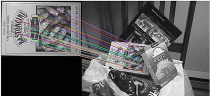
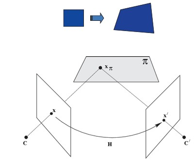

## 37a  Affine Mapping Examples & Homography (part 1) s. 160
<!--
### Affine mapping: example \* 161

### Projective mapping (homography) 161
-->
Here’s the rewritten, study-friendly version of **37a Affine Mapping Examples & Homography (part 1)** in plain Markdown:

---

### Preview

In this section, we explore practical examples of affine mapping using SIFT features and then move on to **homography (projective mapping)**, which allows us to describe how planar surfaces change between images.

---

### Affine mapping: example

* **Step 1:** Use **SIFT features** to detect and match corresponding points between a template and a test image.
* **Step 2:** Estimate the affine transformation. The transformation matrix looks like:

```
[[ 5.32553140e-01  -9.58996182e-02   1.11868625e+02]
 [ 6.74450191e-02   5.29939377e-01   1.54481791e+02]
 [ 0.00000000e+00   0.00000000e+00   1.00000000e+00]]
```

* **Step 3:** Compute the **residual error** to check how well the transformation works:

$$
\text{std}(b - M\hat{x}) = 0
$$

This means the fit is perfect in this case.

* **Step 4:** Warp and overlay the template onto the test image to confirm the alignment visually.


*Figure: SIFT matches between the template and test image.*


*Figure: The warped template (red) overlaid on the test image after affine mapping.*

---

### Projective mapping (homography)

Homography describes how two images of the same **planar surface** are related, assuming a **pinhole camera** model.

* **Homography equation** between a point \$(x, y)\$ and \$(x', y')\$:

$$
\begin{bmatrix}
wx' \\
wy' \\
w
\end{bmatrix}
=
\begin{bmatrix}
a_{11} & a_{12} & a_{13} \\
a_{21} & a_{22} & a_{23} \\
a_{31} & a_{32} & a_{33}
\end{bmatrix}
\begin{bmatrix}
x \\
y \\
1
\end{bmatrix}
$$

* **Properties**:

  * Lines remain lines after transformation.
  * Angles are **not preserved**.
  * It is a **nonlinear transformation** in \$(x, y)\$ space.


*Figure: Homography projects points from one image plane to another, through the 3D plane \$\pi\$.*

---

### Recap

* Affine transformations can be estimated from point matches (e.g., with SIFT).
* Residual error shows how well the transformation fits.
* Homography generalizes affine mapping to cover any planar surface under perspective projection.
* Lines remain lines, but lengths and angles may distort.

---

### Stop to think

Why do we need **homography** instead of just affine mapping when working with real camera images of flat surfaces?


